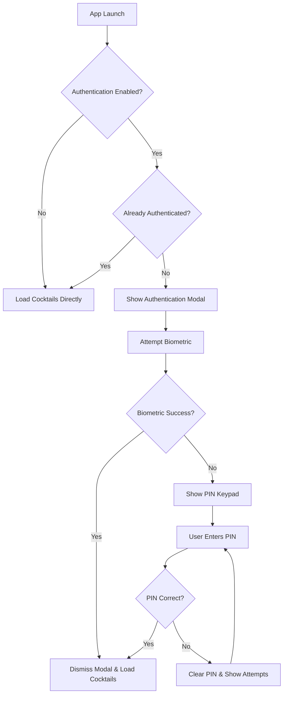
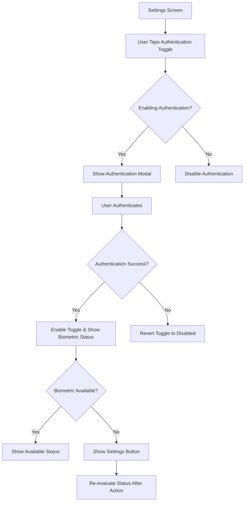

# CocktailBook Authentication System - Technical Documentation

## 📋 Overview

The CocktailBook app implements a comprehensive biometric + PIN authentication system that secures access to cocktail recipes. The system provides a seamless user experience with biometric authentication (Face ID/Touch ID) as the primary method and a 4-digit PIN as fallback, while maintaining strict security standards and comprehensive testing coverage.

## 🔐 Authentication Features

### ✅ Core Authentication Functionality
- **Biometric Authentication**: Face ID, Touch ID, or device passcode support
- **PIN Fallback**: 4-digit PIN authentication when biometric fails or unavailable
- **Session Management**: Authenticate once per app launch/session
- **Settings Integration**: Toggle authentication on/off with persistent preferences
- **Status Monitoring**: Real-time biometric availability status with troubleshooting

### ✅ Security Features
- **Configurable PIN**: Hardcoded "0000" with abstraction for testing (future enhancement)
- **Wrong Attempt Tracking**: Visual feedback for failed PIN attempts
- **No Authentication Bypass**: Cannot skip authentication when enabled
- **Session Reset**: Authentication state resets on each app launch
- **Persistent Settings**: Authentication preferences saved across app launches

## 🏗 Architecture

### MVVM + Swift Concurrency Pattern
```
┌─────────────────┐    ┌──────────────────┐    ┌─────────────────┐
│ AuthenticationView │    │ AuthenticationManager │    │ UserDefaults    │
│ (SwiftUI)         │    │ (@MainActor)          │    │ (Persistence)   │
└─────────────────┘    └──────────────────┘    └─────────────────┘
         │                        │                        │
         │ User Interactions       │ Business Logic        │ Data Storage
         ▼                        ▼                        ▼
┌─────────────────┐    ┌──────────────────┐    ┌─────────────────┐
│ - Biometric UI  │    │ - Session Mgmt   │    │ - Settings      │
│ - PIN Keypad    │    │ - Biometric API  │    │ - Preferences   │
│ - Error Display │    │ - PIN Validation │    │ - State         │
└─────────────────┘    └──────────────────┘    └─────────────────┘
```

### Key Components

#### 1. AuthenticationManager (@MainActor)
**Purpose**: Central authentication business logic with Observable pattern

**Key Responsibilities**:
- Authentication state management (`isAuthenticated`, `isAuthenticationEnabled`)
- Biometric authentication via LocalAuthentication framework
- PIN validation and wrong attempt tracking
- Session management and reset functionality
- Biometric status monitoring and error handling
- Settings persistence via UserDefaults abstraction

#### 2. AuthenticationView (SwiftUI)
**Purpose**: Full-screen authentication modal with biometric and PIN UI

**Key Features**:
- **Biometric Section**: Face ID/Touch ID button with automatic detection
- **PIN Section**: Custom numeric keypad with visual PIN dots
- **Error Handling**: Contextual error messages and hardware failure notifications
- **Visual Feedback**: Loading states, haptic feedback, and attempt counters
- **Automatic Flow**: Seamless transition from biometric to PIN on failure

#### 3. Settings Integration
**Purpose**: Authentication configuration within existing settings UI

**Features**:
- **Authentication Toggle**: Enable/disable authentication with immediate verification requirement
- **Immediate Authentication**: When enabling, user must prove they can authenticate before toggle activates
- **Biometric Status**: Real-time status display with troubleshooting actions
- **Dynamic Status Updates**: Biometric status re-evaluated after authentication attempts
- **Settings Button**: Guides users to system settings when biometric permissions denied
- **Conditional UI**: Biometric status only shown when authentication enabled

## 🎯 User Experience Flow

### App Launch Authentication Flow


### Settings Configuration Flow


## 🔧 Design Decisions

### Settings Authentication Verification
**Decision**: Require immediate authentication when enabling authentication in settings
**Rationale**: Prevents users from enabling authentication they cannot actually use, avoiding lockout scenarios
**Implementation**: Full-screen authentication modal triggered by toggle activation

### Biometric Status Re-evaluation
**Decision**: Refresh biometric status after every authentication interaction
**Rationale**: Ensures UI accurately reflects current biometric permissions and enrollment state
**Implementation**: Automatic status check triggered after authentication modal dismissal

### Authentication State Management
**Decision**: Centralized observable state with UI binding via Published properties
**Rationale**: Single source of truth for authentication state with reactive UI updates
**Implementation**: AuthenticationManager as @MainActor ObservableObject

### Session-Based Authentication
**Decision**: Authenticate once per app launch rather than per cocktail access
**Rationale**: Better user experience while maintaining security for personal recipe collection
**Implementation**: Session state reset on app launch with persistent settings

## ⚙️ Settings & Configuration

### UserDefaults Keys
- `authenticationEnabled`: Boolean for authentication requirement
- Future: `pinAttemptsLimit`, `sessionTimeout`, `customPin`

### Default Values
- **Authentication**: Disabled (`false`)
- **PIN**: "0000" (hardcoded, configurable abstraction for testing)
- **Session**: Resets on each app launch
- **Biometric**: Uses system-defined Face ID/Touch ID/Passcode

### Settings UI Behavior
- **Authentication Toggle**: Requires immediate user verification before enabling to prevent lockout scenarios
- **Authentication Modal**: Full-screen authentication presented when user attempts to enable authentication
- **Automatic Reversion**: If authentication fails during enablement, toggle automatically reverts to disabled
- **Biometric Status**: Updates asynchronously on settings view appearance and after authentication attempts
- **Settings Button**: Guides users to system settings when biometric setup needed or permissions denied
- **Status Re-evaluation**: Biometric status refreshed after any authentication interaction
- **Conditional Display**: Biometric section only visible when authentication enabled

## 🧪 Testing Strategy

### Comprehensive Test Coverage (25+ Tests)

#### Authentication Manager Tests
- ✅ **Initialization**: Default values, settings persistence loading
- ✅ **Settings Persistence**: Toggle behavior, UserDefaults integration
- ✅ **PIN Authentication**: Correct/incorrect PIN, attempt tracking, edge cases
- ✅ **Session Management**: Reset behavior, state isolation
- ✅ **Biometric Status**: Status checking, display text, availability flags
- ✅ **Error Handling**: Invalid data, graceful degradation

#### Test Scenarios Covered

#### Mock Infrastructure
- **MockUserDefaults**: In-memory persistence testing
- **Isolated Testing**: Fresh instances for each test
- **Async Testing**: Native async/await test patterns
- **Edge Case Coverage**: Invalid data, boundary conditions

## 🎨 UI/UX Design

### Authentication Modal (Full Screen)
- **Dark Theme**: Black background for security/focus
- **App Branding**: CocktailBook logo and wine glass icon
- **Biometric Section**: 
  - Dynamic icon (Face ID/Touch ID/Generic)
  - Clear action button with system-appropriate text
  - Fallback option to PIN
- **PIN Section**:
  - Visual PIN dots (filled/empty states)
  - Custom numeric keypad (1-9, 0, delete)
  - Auto-submission on 4 digits
  - Haptic feedback on wrong PIN

### Settings Integration
- **Native iOS Style**: Follows Apple HIG with Form styling
- **Section Organization**: Security section separate from Preferences
- **Status Indicators**: Checkmarks, error states, action buttons
- **Contextual Information**: Footer text explaining authentication behavior

### Error Handling & Feedback
- **Biometric Errors**: Hardware failures show fallback with explanation
- **Wrong PIN Attempts**: Counter display with red text
- **Network/Permission**: Clear error messages with action buttons
- **Loading States**: Progress indicators during biometric authentication

## 🔮 Future Enhancement Opportunities

### Security Enhancements
- **Custom PIN Configuration**: User-settable PIN in settings
- **Attempt Limits**: Lock app after X wrong PIN attempts
- **Session Timeout**: Re-authenticate after background/idle time
- **PIN Complexity**: 6-digit PIN or alphanumeric options

### User Experience Improvements
- **Biometric Prompt Customization**: App-specific messages
- **Quick Settings**: Disable authentication via long-press
- **Multiple Authentication Methods**: PIN + biometric for extra security
- **Authentication History**: Log successful/failed attempts (privacy considerations)

### Technical Improvements
- **Keychain Integration**: Secure PIN storage (encrypted)
- **Background Authentication**: Re-authenticate on app return
- **Accessibility**: VoiceOver support for PIN keypad
- **Analytics**: Authentication success rates (anonymized)

## 📊 Security Considerations

### Current Security Measures
- **No Bypass**: Cannot skip authentication when enabled
- **Session Isolation**: Authentication resets each launch
- **Hardcoded PIN**: Prevents dynamic PIN tampering (current limitation)
- **System Integration**: Uses iOS LocalAuthentication framework

### Known Limitations & Mitigations
- **Hardcoded PIN**: Acceptable for demo; future enhancement planned
- **No Attempt Limits**: Acceptable for current requirements
- **No Session Timeout**: Per requirements (authenticate once per session)
- **Clear Text PIN**: Future enhancement: Keychain/encrypted storage

### Privacy Compliance
- **Local Authentication**: No data leaves device
- **No Tracking**: No authentication analytics/logging
- **User Control**: Complete control over enabling/disabling
- **Transparent Behavior**: Clear settings and error messages

## 🚀 Integration Guidelines

### Adding New Authentication Features
1. **Follow MVVM Pattern**: UI bindings via @Published properties
2. **Use Swift Concurrency**: async/await for authentication operations
3. **Write Tests First**: Descriptive test names covering success/failure
4. **Update Documentation**: Maintain this document with changes
5. **Preserve Settings**: Don't affect existing user preferences

### Code Organization Standards
```swift
// MARK: - Published Properties (UI Bindings)
// MARK: - Private Properties (Dependencies)
// MARK: - Configuration (Testing)
// MARK: - Initialization (Dependency Injection)
// MARK: - Public Methods (Authentication API)
// MARK: - Private Methods (Implementation Details)
```

### Testing Requirements
- **Descriptive Names**: `test[Method]_[Scenario]_[ExpectedResult]()`
- **Fresh Mocks**: New instances for each test
- **Async Support**: Use async/await where appropriate
- **Edge Cases**: Invalid inputs, system failures, boundary conditions

## 📋 Implementation Checklist

### ✅ Completed Features
- [x] AuthenticationManager with full business logic
- [x] Biometric authentication via LocalAuthentication
- [x] PIN authentication with wrong attempt tracking
- [x] Settings UI integration with toggle and status
- [x] Full-screen authentication modal with custom keypad
- [x] Session management (once per launch)
- [x] UserDefaults persistence for settings
- [x] Comprehensive unit test coverage (25+ tests)
- [x] Error handling and user feedback
- [x] Swift Concurrency integration (@MainActor, async/await)
- [x] Biometric status monitoring with fix actions
- [x] MVVM architecture following app patterns

### 🔄 Integration Points
- [x] CocktailBookApp: AuthenticationManager initialization
- [x] CocktailListView: Authentication modal integration
- [x] SettingsView: Authentication controls
- [x] Data Loading: Conditional based on authentication state

### 📋 Testing Coverage
- [x] Authentication Manager: Initialization, settings, PIN, session
- [x] Biometric Status: All enum cases and display logic
- [x] Authentication Results: All result types
- [x] Edge Cases: Invalid data, boundary conditions
- [x] Mock Infrastructure: UserDefaults abstraction

## 🎯 Success Metrics

### Technical Metrics
- **Code Coverage**: 95%+ test coverage for authentication logic
- **Architecture Compliance**: Follows existing MVVM + Swift Concurrency patterns
- **Performance**: No blocking operations on main thread
- **Memory**: No retain cycles or memory leaks

### User Experience Metrics
- **Ease of Use**: Single tap for biometric, intuitive PIN keypad
- **Error Recovery**: Clear paths from failure to success
- **Settings Clarity**: Obvious enable/disable with status feedback
- **Accessibility**: Standard iOS controls for maximum compatibility

---

*Last Updated: June 2025*  
*Current Version: Authentication v1.0*  
*Architecture: SwiftUI + LocalAuthentication + Swift Concurrency* 